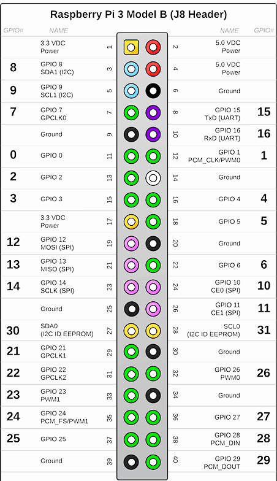

Electronics
=============

Pi and Arduino Communication
----------------------------

I2C Method
^^^^^^^^^^

*The code is from https://oscarliang.com/raspberry-pi-arduino-connected-i2c/, with slight changes to accommodate python 3 instead of python 2*

Using I2C protocol, we could communicate between raspberry pi and arduino using only three wires

The wiring is:

.. image:: electronics/PiArduinoI2CHardware_bb.jpg
  :width: 500

Raspberry pi and Arduino both agree on the a slave address of 0x04

**Upload Arduino code to Arduino board**

The testing code is:

.. code-block:: c
  :linenos:

  #include <Wire.h>
  #define SLAVE_ADDRESS 0x04
  int number = 0;
  int state = 0;

  void setup() {
    pinMode(13, OUTPUT);
    Serial.begin(9600); // start serial for output

    // initialize i2c as slave
    Wire.begin(SLAVE_ADDRESS);

    // define callbacks for i2c communication
    Wire.onReceive(receiveData);
    Wire.onRequest(sendData);
    Serial.println("Ready!");
  }

  void loop() {
    delay(100);
  }

  // callback for received data
  void receiveData(int byteCount){
    while(Wire.available()) {
      number = Wire.read();
      Serial.print("data received: ");
      Serial.println(number);
      if (number == 1){
        if (state == 0){
          digitalWrite(13, HIGH); // set the LED on
          state = 1;
        }
        else{
          digitalWrite(13, LOW); // set the LED off
          state = 0;
        }
      }
    }
  }

  // callback for sending data
  void sendData(){
    Wire.write(number);
  }

**Run the python code on the raspberry pi**

The testing code is:

.. code-block:: python
  :linenos:

  import smbus
  import time
  # for RPI version 1, use  ^ ^ bus = smbus.SMBus(0) ^ ^
  bus = smbus.SMBus(1)

  # This is the address we setup in the Arduino Program
  address = 0x04

  def writeNumber(value):
    bus.write_byte(address, value)
    # bus.write_byte_data(address, 0, value)
    return -1

  def readNumber():
    number = bus.read_byte(address)
    # number = bus.read_byte_data(address, 1)
    return number

  while True:
    var = int(input("Enter 1  ^ ^  9: "))
    if not var:
        continue

    writeNumber(var)
    print("RPI: Hi Arduino, I sent you ", var)
    # sleep one second
    time.sleep(1)

    number = readNumber()
    print("Arduino: Hey RPI, I received a digit ", number)
    print()

See Also:
#########
* `SMBus Package <https://pypi.org/project/smbus-cffi/>`_

SPI Method
^^^^^^^^^^

USB Method
^^^^^^^^^^

PI and TFMini Lidar Communication
------------------------------------

Setup
^^^^^^^^^^
To search for available serial ports, enter the following command in terminal:

.. code-block:: bash

  $ dmesg | grep tty

If the output looks like

.. code-block:: bash

  pi@raspberrypi:~ $ dmesg | grep tty
  [    0.000000] Kernel command line: 8250.nr_uarts=1 bcm2708_fb.fbwidth=1824 bcm2708_fb.fbheight=984 bcm2708_fb.fbswap=1 dma.dmachans=0x7f35
  bcm2709.boardrev=0xa02082 bcm2709.serial=0x11f38c9c bcm2709.uart_clock=48000000 smsc95xx.macaddr=B8:27:EB:F3:8C:9C vc_mem.mem_base=0x3dc00000
  vc_mem.mem_size=0x3f000000  dwc_otg.lpm_enable=0 console=tty1 console=ttyS0,115200 root=/dev/mmcblk0p7 rootfstype=ext4 elevator=deadline
  fsck.repair=yes rootwait splash plymouth.ignore-serial-consoles
  [    0.001365] console [tty1] enabled
  [    0.343313] console [ttyS0] disabled
  [    0.343481] 3f215040.uart: ttyS0 at MMIO 0x3f215040 (irq = 59, base_baud = 31250000) is a 16550
  [    1.078177] console [ttyS0] enabled
  [    2.210431] 3f201000.uart: ttyAMA0 at MMIO 0x3f201000 (irq = 87, base_baud = 0) is a PL011 rev2
  [    3.527349] systemd[1]: Expecting device dev-ttyS0.device...
  [    4.653975] systemd[1]: Starting system-serial\x2dgetty.slice.
  [    4.669517] systemd[1]: Created slice system-serial\x2dgetty.slice.

the console needs to be disabled on the serial port ttyAMA0.

To do so, run the configuration command

.. code-block:: bash

  $ sudo raspi-config

and navigate to option 5, Interfacing Options. Choose P6, Serial.

When prompted, answer No to "Would you like a login shell to be accessible over serial?" and Yes to "Would you like the seria port hardware to be enabled?".

Enter the following command to reboot and search for available ports again:

.. code-block:: bash

  $ sudo reboot
  $ dmesg | grep tty

The output now should look like:

.. code-block:: bash

  pi@raspberrypi:~ $ dmesg | grep tty
  [    0.000000] Kernel command line: 8250.nr_uarts=1 bcm2708_fb.fbwidth=1824 bcm2708_fb.fbheight=984 bcm2708_fb.fbswap=1
  dma.dmachans=0x7f35 bcm2709.boardrev=0xa02082 bcm2709.serial=0x11f38c9c bcm2709.uart_clock=48000000
  smsc95xx.macaddr=B8:27:EB:F3:8C:9C vc_mem.mem_base=0x3dc00000 vc_mem.mem_size=0x3f000000  dwc_otg.lpm_enable=0
  console=tty1 root=/dev/mmcblk0p7 rootfstype=ext4 elevator=deadline fsck.repair=yes rootwait splash plymouth.ignore-serial-consoles
  [    0.001345] console [tty1] enabled
  [    0.343464] 3f215040.uart: ttyS0 at MMIO 0x3f215040 (irq = 59, base_baud = 31250000) is a 16550
  [    1.146776] 3f201000.uart: ttyAMA0 at MMIO 0x3f201000 (irq = 87, base_baud = 0) is a PL011 rev2

Wiring
^^^^^^^^^^

+--------------+-----------+
|Rasberry Pi 3 |TFmini     |
+==============+===========+
| +5V          | 5V (RED)  |
+--------------+-----------+
| GND          |GND (BLACK)|
+--------------+-----------+
|TXD0          |RX (WHITE) |
+--------------+-----------+
|RXD0          |TX (GREEN) |
+--------------+-----------+

The pinout of the Rasberry Pi is:

Code
^^^^^^^^^^

.. code-block:: python
    :linenos:

    # tfmini.py
    # supports Python 2
    # prints distance from sensor

    #coding: utf-8
    import serial
    import time
    ser = serial.Serial("/dev/ttyS0", 115200)

    def getTFminiData():
    while True:
        count = ser.in_waiting
        #count = 0
        #print(count)
        if count > 8:
            recv = ser.read(9)
            ser.reset_input_buffer()
            if recv[0] == 'Y' and recv[1] == 'Y': # 0x59 is 'Y'
                low = int(recv[2].encode('hex'), 16)
                high = int(recv[3].encode('hex'), 16)
                distance = low + high * 256
                print('distance is: ')
                print(distance)
                time.sleep(1)

    if __name__ == '__main__':
        try:
            if ser.is_open == False:
                ser.open()
                getTFminiData()
        except KeyboardInterrupt:   # Ctrl+C
            if ser != None:
                ser.close()

.. code-block:: python
    :linenos:

    # tfmini_2.py
    # supports Python 2 or Python 3
    # prints distance and strength from sensor

    #coding: utf-8
    import serial
    import time

    ser = serial.Serial("/dev/ttyS0", 115200)

    def getTFminiData():
        while True:
            #time.sleep(0.1)
            count = ser.in_waiting
            if count > 8:
                recv = ser.read(9)
                ser.reset_input_buffer()
                # type(recv), 'str' in python2(recv[0] = 'Y'), 'bytes' in python3(recv[0] = 89)
                # type(recv[0]), 'str' in python2, 'int' in python3

                if recv[0] == 0x59 and recv[1] == 0x59:     #python3
                    distance = recv[2] + recv[3] * 256
                    strength = recv[4] + recv[5] * 256
                    print('(', distance, ',', strength, ')')
                    ser.reset_input_buffer()

                if recv[0] == 'Y' and recv[1] == 'Y':     #python2
                    lowD = int(recv[2].encode('hex'), 16)
                    highD = int(recv[3].encode('hex'), 16)
                    lowS = int(recv[4].encode('hex'), 16)
                    highS = int(recv[5].encode('hex'), 16)
                    distance = lowD + highD * 256
                    strength = lowS + highS * 256
                    print(distance, strength)

                # you can also distinguish python2 and python3:
                #import sys
                #sys.version[0] == '2'    #True, python2
                #sys.version[0] == '3'    #True, python3

    if __name__ == '__main__':
        try:
            if ser.is_open == False:
                ser.open()
            getTFminiData()
        except KeyboardInterrupt:   # Ctrl+C
            if ser != None:
                ser.close()

Resources
^^^^^^^^^
  * `READ AND WRITE FROM SERIAL PORT WITH RASPBERRY PI <http://www.instructables.com/id/Read-and-write-from-serial-port-with-Raspberry-Pi/>`_
  * `TFmini-RaspberryPi <https://github.com/TFmini/TFmini-RaspberryPi>`_

PI and IMU communication
------------------------

I2C Method
^^^^^^^^^^

*The example code for this section in the PiCar/src/pi/imu*

To compile, use the command:

$gcc -o <programname> runi2c.c -lm

Wiring:

+----------------+-----------+
|RPI             |IMU        |
+================+===========+
|Pin 1 (3.3v)    |Vcc        |
+----------------+-----------+
|Pin 3           |SDA        |
+----------------+-----------+
|Pin 5           |SCL        |
+----------------+-----------+
|Pin 6           |Gnd        |
+----------------+-----------+

The connection is by SMBUS.

For RPI, go to /usr/include/linux, replace i2c_dev.h with the header file in the repository

(Method 'enableIMU' needs further development to enable IMU configuration setting)

See Also:
#########

* `IMU datasheet <https://cdn.sparkfun.com/assets/learn_tutorials/3/7/3/LSM9DS1_Datasheet.pdf/>`_

Resources
^^^^^^^^^
* `I2C <https://learn.sparkfun.com/tutorials/i2c>`_

I2C SPI Reference page

Contributors: Jerry Kong, Shadi Davari, Josh Jin
