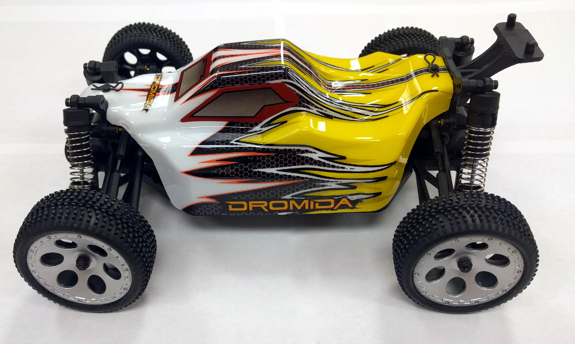
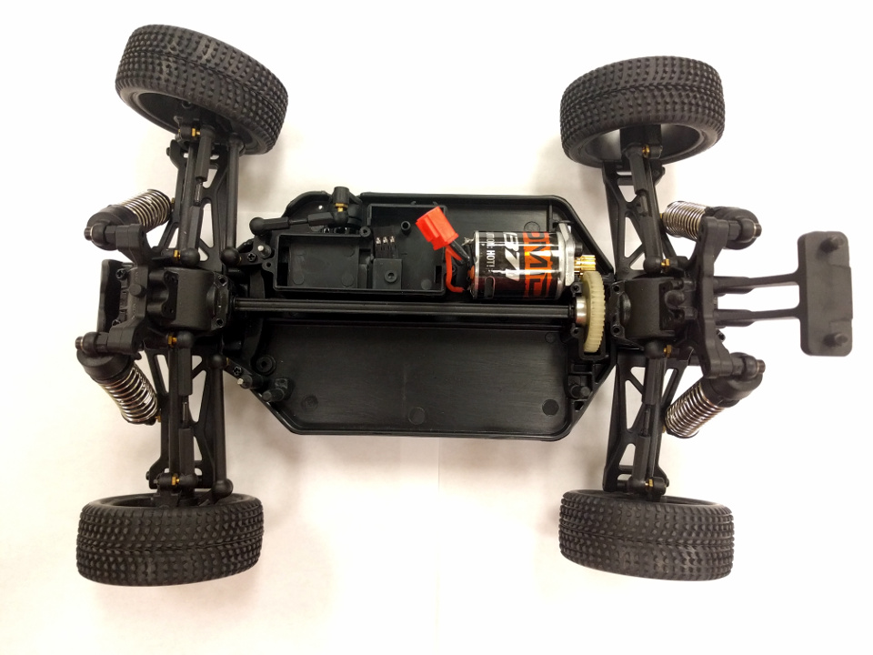
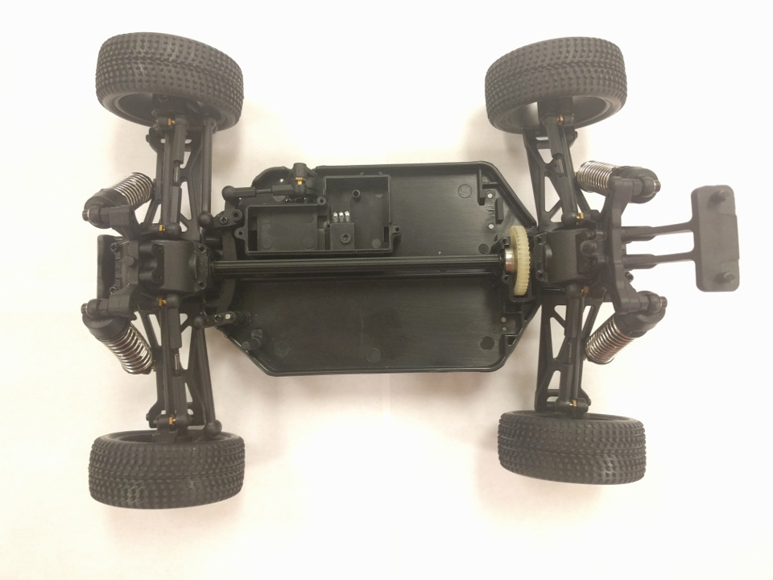
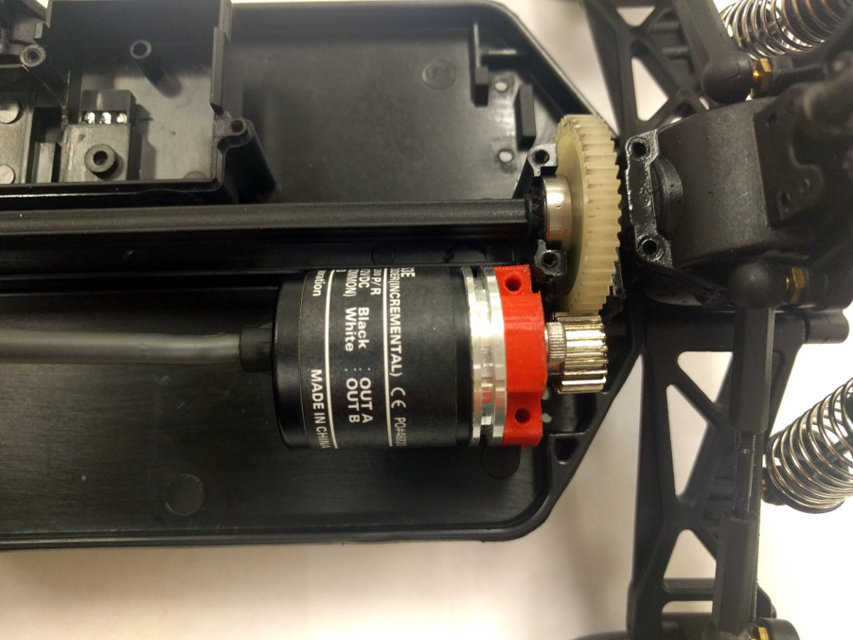
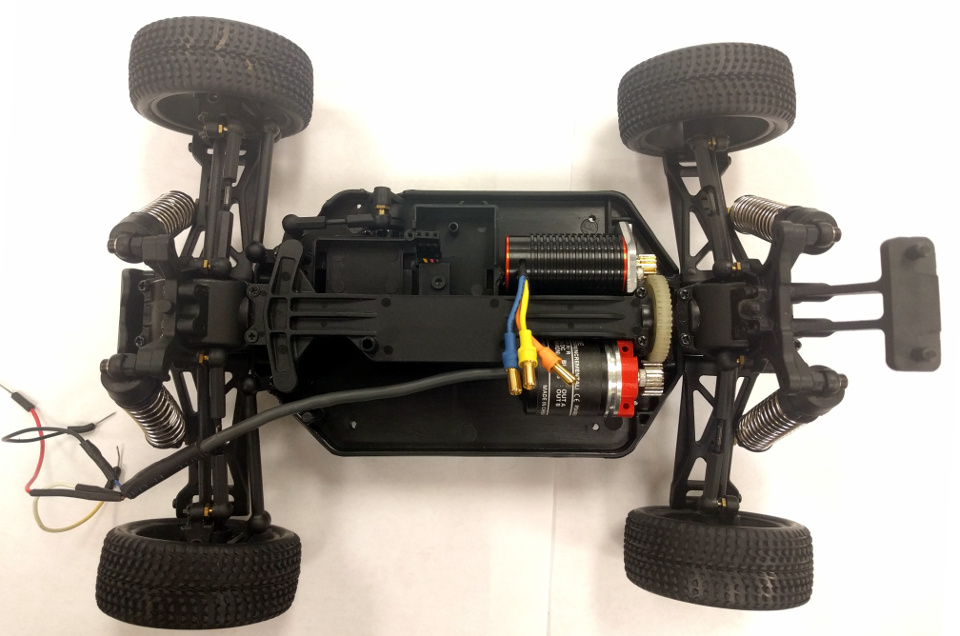
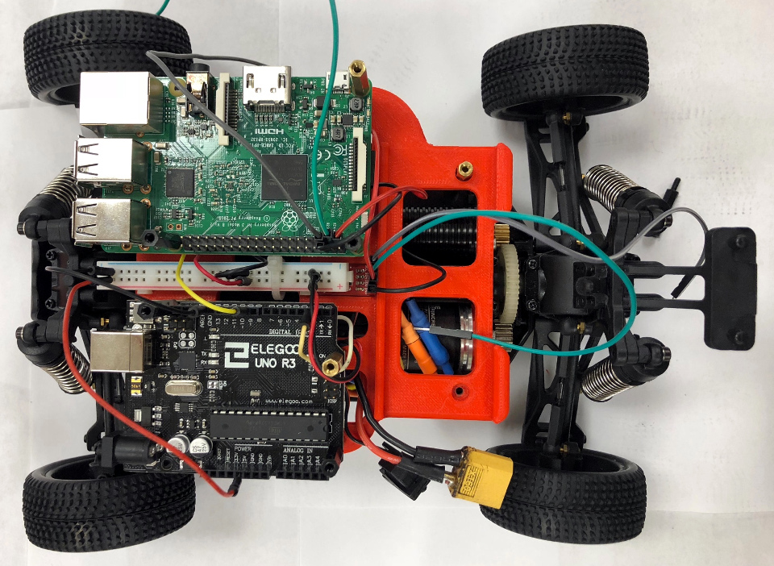
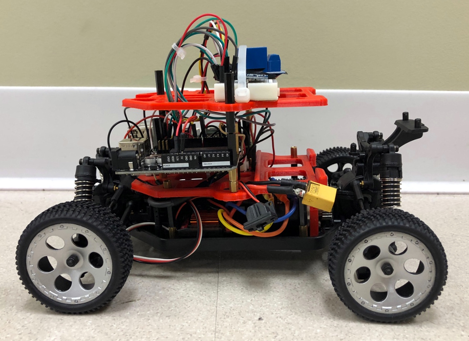
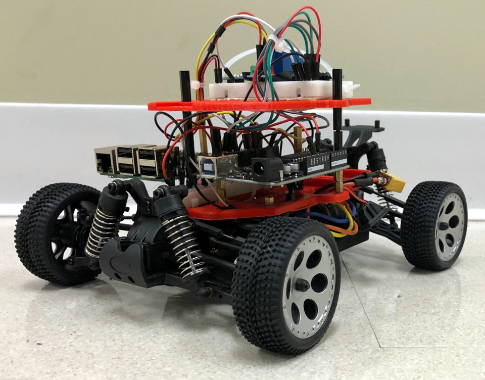

Mechanical
=================

The mechanical documentation involves designing, 3D printing and assembling
the PiCar chassis

.. caution::
  The mechanical design and assembly of the PiCar will continue
  being modified over the course of the research. The following guide reflects
  the earliest version of PiCar v2.0.

Design
------
For the base chassis of PiCar v2, we will be using the ``Dromida 1/18 Scale
Buggy``. To retrofit it with sensors and micro-controllers, we will be adding
some 3D printed parts.

CAD
^^^^^^
The parts are designed using `Autodesk Fusion 360
<https://www.autodesk.com/products/fusion-360>`_. We will be splitting the
chassis into three layers, connected with spacers for better management:

Layer Zero
  - Dromida buggy (without cover)
  - DC Motor (drive)
  - Servo (steer)
  - Encoder
  - ESC (Electronic Speed Controller)

Layer One
  - Raspberry Pi
  - Arduino
  - Lipo Battery(s)
  - Current sensors
  - IMU (Intertial Measurement Unit)

Layer Two
  - Servo (LIDAR)
  - TFMini LIDAR
  - PiCamera

Materials Required
^^^^^^^^^^^^^^^^^^
.. csv-table::
   :header-rows: 1
   :file: mechanical/bill_of_materials.csv

.. warning::

   The 7.4V LiPo battery must be used with care. Use a voltmeter or battery
   checker to ensure that the battery voltage does not drop below 30%.

.. note::

   If the ``48P 20T 4mm bore Pinion Gear`` cannot be found, buy a 48P 20T Pinion
   Gear and use a drill to create a 4mm bore (shaft diamater).

Assembly
--------

Tools Required:

- Dremel kit (with drill and sanding bits)
- Screw drivers
- Pliers

1. Download the Fusion 360 CAD files, convert them to STL and 3D print them.

  - Encoder Mount: `<https://a360.co/2DUNNK6>`_
  - First Layer: `<https://a360.co/2RquoDs>`_
  - Second Layer: `<https://a360.co/2OBMGmP>`_
  - Camera: `<https://a360.co/2QQB4dp>`_

2. For PiCar v2.0, the ``Dromida 1/18th Scale Buggy`` was used:

   Dromida 1/18th Scale Buggy

3. Remove the plastic covering and unplug the NiMh battery.
We will be using a ``LiPo battery`` to power the PiCar.

.. figure:: mechanical/assembly002.jpg
   :alt: PiCar (casing removed)
   :align: center

   Buggy with plastic casing and battery removed

4. Unscrew, and remove the rear gear covering and the plastic
spline that goes along the center of the car.

.. figure:: mechanical/assembly003.jpg
   :alt: Rear gear covering and spine removed
   :align: center

   Rear gear covering and spine removed

5. Unscrew the plastic cover for the ``ESC`` (Electronic Speed Controller).
Unplug the motor and servo connectors from the ``ESC``. Remove the motor from
the car. Do not remove the servo.

   ESC removed

6. Unscrew the metallic motor mount. Pull out the plastic 'pillar' on the
left of the rear gear.

   Motor removed

7. Since we are using a rotary ``encoder`` for the low level speed controller,
we need to ensure that the ``encoder`` meshes with the rear gear. Using the dremel
and a sanding tool, carefully clear away the plastic from the gear as shown.

.. figure:: mechanical/assembly006.jpg
   :alt: Plastic cleared away for meshing Encoder
   :align: center

   Plastic cleared away for meshing Encoder

Ensure that the ``encoder`` with its ``pinion gear`` meshes with the rear gear
and is not blocked by the plastic casing.

8. Screw in the ``printed encoder mount`` to the ``encoder`` and place it
on the ``chassis`` as shown in the figure:

   Placed the encoder

Ensure that the rear gear rotates along with the ``encoder gear`` with little
to no friction. Holding the encoder in place, using a long narrow tipped
screwdriver or nail or drill-bit, mark where the mounting holes would go.
Drill 2mm holes in those points and mount the ``encoder`` either by using screws
on the bottom of the ``chassis`` (recommened), or from the top.

9. Replace the ``Dromida motor`` with the ``TrackStar Motor``. Screw the motor
mount back in.

.. figure:: mechanical/assembly008.jpg
   :alt: Replaced the default motor witht he TrackStar motor.
   :align: center

   Replaced the default motor with the TrackStar motor.

10. Now we are going to begin adding the layers that hold the electronics. Drill
2mm holes as specified in the following figure:

   Drilled holes to mount the first printed layer

.. note::

   It may be more convenient to use the corner mounting holes as a guide to
   mark the locations of the holes on the base.

11. Connect the ``TrackStar ESC`` to the motor using the color coded wires.
Reattach the spine:

.. figure:: mechanical/assembly010.jpg
   :alt: Connected the ESC
   :align: center

   ESC connected

12. Before we mount the ``printed first layer`` to the car using ``spacers``,
it may help to mount the ``IMU``, ``Raspberry Pi``, and the ``Arduino`` to the
first layer.

Pre-requisites for this step:
  - Create a common GND and +5V channel (we used a broken off piece from a small
    ``breadboard``)
  - Wire the ``IMU`` and mount it to the first layer using a screw.
  - Mount the ``Arduino`` and ``Raspberry Pi`` in their respective positions
    using ``spacers``.

   First Layer Setup

Post-requisites for this step:
  - Connect the ``steering servo``, ``ESC`` and the ``encoder`` to the
    ``Raspberry Pi`` using `usage/electronics.html <electronics.html>`_
  - Mount the ``printed first layer`` to the ``chassis`` using ``spacers``
    (preferably metal ones)

13. Mount the ``printed second layer`` to the chassis using the ``spacers``.

.. figure:: mechanical/assembly012.jpg
   :alt: Second Layer Setup
   :align: center

   Second Layer Setup

14. Again, using `usage/electronics.html <electronics.html>`_ as a guide,
complete the electrical assembly for the second layer.

This includes:
  - Connecting a ``relay`` that acts as a kill switch
  - Connecting the SPI / I2C communication between the ``Raspberry Pi`` and the
    ``Arduino``
  - Connecting the ``IMU`` to the ``Raspberry Pi``

Now the PiCar is usable, and should look like this:

   PiCar: Side View

   PiCar: Isometric View

15. Once the base PiCar has been built, you can add the ``Lidar``, ``PiCamera``,
etc. using the 3D printed mounts, and wire them accordingly.

Ending notes:
  - The ``LiPo battery`` sits in the first layer, behind the microcontrollers.
  - For the time being, we are using a ``compact power bank`` to power the
    ``Raspberry Pi``, which in turn powers the ``Arduino`` via USB.
